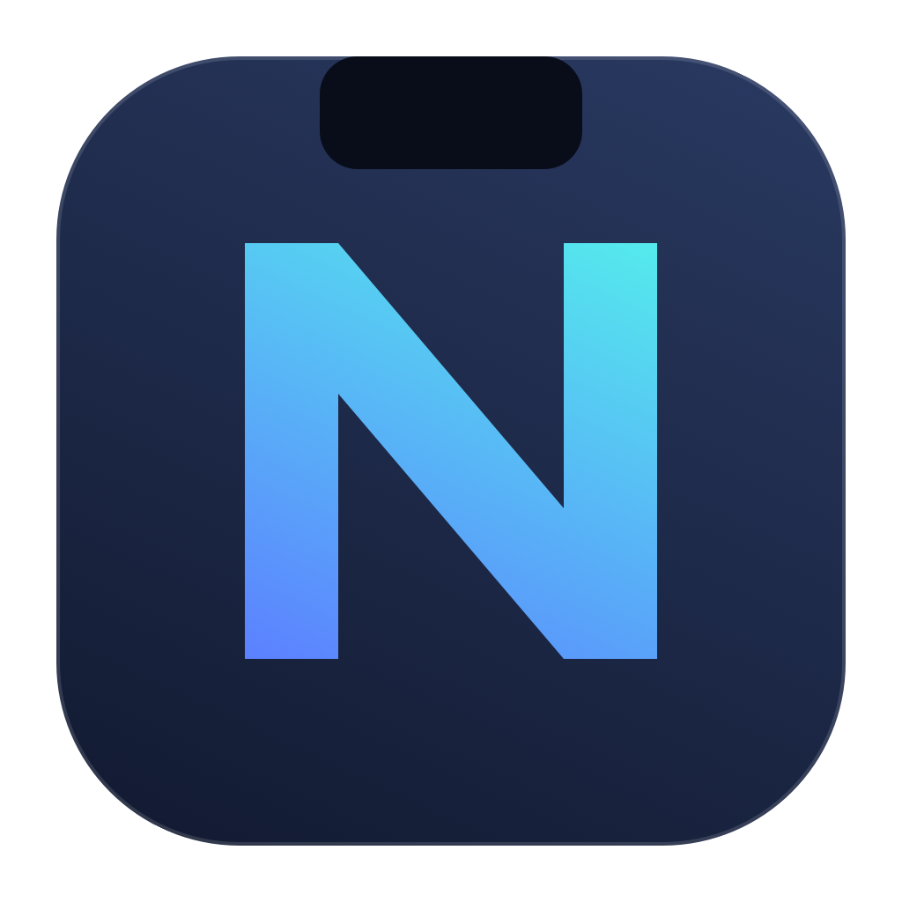

<div align="center">
  
  <h1>NotchHub</h1>
  <p>面向 macOS 的刘海工作台：音乐控制、任务专注、剪贴板历史与 AI 对话。</p>
  <p>
    <a href="https://github.com/Wangxmian/NotchHub/releases">下载</a> ·
    <a href="https://github.com/Wangxmian/NotchHub/issues">问题反馈</a> ·
    <a href="https://github.com/Wangxmian/NotchHub/pull/1">剪贴板开发进度</a>
  </p>
</div>

## 项目状态

| 渠道 | 状态 | 适用场景 |
| --- | --- | --- |
| 稳定发布 | `v1.2.0`，见 [Releases](https://github.com/Wangxmian/NotchHub/releases) | 日常使用音乐、待办番茄钟及现有模块 |
| 开发预览 | `1.3.0-preview`；分支 `clipboard-maccy-parity` | 试用完整剪贴板能力及统一设置 |

剪贴板开发以 **Maccy 2.7.1** 为固定行为基线。数据、搜索、操作、设置及系统接口已接入，完整功能一致的正式发布仍需通过全部系统实测。预览版不代表已完成全部验收。

## 功能概览

| 模块 | 主要能力 |
| --- | --- |
| 音乐 | 当前歌曲与播放进度展示，播放、暂停和切歌控制；播放器能力依适配器与系统权限而异 |
| 待办与番茄钟 | 任务创建、编辑、排序和完成；将任务关联到专注计时 |
| 专注记录 | 记录任务名称、专注时长和结束状态；完整结束一轮才计入完成番茄数 |
| 刘海摘要 | 收起时显示任务与剩余时间等进行中状态 |
| 剪贴板 | 稳定版提供基础历史；开发预览扩展搜索、OCR、固定内容、格式保留与快捷操作 |
| AI 对话 | 配置 API 服务与密钥，进行流式对话并管理会话 |

文件暂存入口及拖入唤起已移除，原功能位置用于番茄钟。主页导航方案尚未实现。

### 剪贴板开发预览

- **历史与载荷**：保存文本、富文本、图片与文件引用，保留多格式表示；支持去重、排序、过滤、固定项及旧数据迁移。
- **搜索与预览**：子串、模糊、正则和混合搜索；本地 Vision OCR；长文本与图片预览。
- **操作**：复制、直接粘贴、去格式动作、固定编辑、键盘导航与循环选择；权限或焦点恢复失败时保留复制结果。
- **呈现**：刘海与独立浮动窗口共享历史及操作服务；提供五种弹出位置与菜单栏选项。
- **设置**：六类页面覆盖 36 个用户配置与 4 个快捷键，统一在 NotchHub 设置中管理。
- **系统接口**：defaults 脚本桥接、App Intents、通知与声音，以及 NotchHub 自有 GitHub 发布源。

默认快捷键可在“设置 → 剪贴板 → 通用”中修改或清除：

| 操作 | 默认快捷键 |
| --- | --- |
| 打开剪贴板浮动窗口 | `⌘⇧C` |
| 固定 / 取消固定 | `⌥P` |
| 删除记录 | `⌥Delete` |
| 显示 / 隐藏预览 | `⌃Space` |

默认选择动作是复制。开启“自动粘贴”或“默认移除格式”会改变修饰键语义，设置页会显示当前动作说明。

## 安装与运行

1. 从 [Releases](https://github.com/Wangxmian/NotchHub/releases) 下载对应安装包。
2. 打开 DMG，将 `NotchHub.app` 拖入“应用程序”目录。
3. 启动应用，在刘海面板选择功能；参数和服务配置集中在设置窗口。
4. 安装完成后退出 DMG，保留应用程序目录中的一份应用，避免搜索中出现重复入口。

当前发布包面向 **Apple Silicon**，最低部署目标为 **macOS 13**。macOS 13 的完整剪贴板运行验收仍待完成；暂未提供经过验证的 Intel 安装包。现有本地发布采用临时签名，尚未经过 Apple 公证。

普通剪贴板采集与复制无需辅助功能权限。直接粘贴以及前台窗口位置查询涉及辅助功能授权，通知权限由 macOS 管理。

## 数据与网络行为

- 剪贴板历史、任务、专注记录和应用设置使用本地存储；AI API 密钥由 macOS 钥匙串保存。
- 应用更名升级沿用原有数据目录及凭据服务标识，以保留已有数据；这些内部兼容标识不改变公开应用身份。
- AI 对话请求发送至用户配置的服务。更新检查访问 NotchHub 的 GitHub 发布源。
- 不接入上游应用的统计服务，也不使用上游更新源分发 NotchHub 版本。
- 代码备份与发布包不包含个人剪贴板历史、API 凭据或运行时设置。

## 构建

### 完整 Xcode 工程

稳定源码位于 `main`。复现剪贴板预览时，先切换到开发分支：

```sh
git switch clipboard-maccy-parity
```

使用完整 Xcode 打开 `NotchToolbox/NotchToolbox.xcodeproj`，选择 **NotchToolbox** scheme。工程内部模块名保留为 `NotchToolbox`，应用产品名为 `NotchHub`。

当前 CI 使用 macOS 15 与 Xcode 26.3：

```sh
xcodebuild -project NotchToolbox/NotchToolbox.xcodeproj \
  -scheme NotchToolbox -configuration Release \
  -destination 'generic/platform=macOS' \
  -derivedDataPath build \
  CODE_SIGNING_ALLOWED=NO MACOSX_DEPLOYMENT_TARGET=13.0 build
```

以上命令用于构建验证。分发前仍需独立完成签名、安装包校验和发布验收。

### Command Line Tools 本地构建

仅安装 Command Line Tools 时，可复用已安装应用的资源目录及音乐辅助工具：

```sh
python3 NotchToolbox/LocalBuild/build_local.py \
  --template /Applications/NotchHub.app \
  --output /private/tmp/NotchHub-build/NotchHub.app \
  --version 1.3.0-preview --build-number 27
```

输出路径必须不存在。此方式不能替代完整工程验证，**不会提取 App Intents 元数据**，因此不能用它确认系统快捷指令发现与执行正常。

## 验证与代码备份

```sh
# 番茄钟行为回归
python3 NotchToolbox/LocalBuild/verify.py

# 剪贴板行为回归，含真实 Vision OCR
python3 NotchToolbox/LocalBuild/verify.py ClipboardRegression.swift
```

本地回归在编译前捕获代码快照，通过后立即备份该快照。即使测试期间工作目录发生变化，备份也对应实际测试的代码。失败的测试不会生成“验证通过”备份。

手动界面检查或其他验证通过后，立即记录对应代码：

```sh
python3 scripts/backup_verified.py \
  --label settings-navigation-ui-passed \
  --evidence /path/to/verification-record.txt
```

默认备份位于仓库同级的 `NotchHub-代码备份/`，包含：

| 文件 | 用途 |
| --- | --- |
| `source.zip` | 实际验证的源码快照，包含尚未提交的新代码 |
| `history.bundle` | 可恢复的已提交 Git 历史 |
| `verification.json` | 基础提交号、工作树状态、验证范围与 SHA-256 |
| `RESTORE.txt` | 源码及提交历史恢复说明 |

GitHub Actions 在每项测试通过后保存对应范围的备份，完整验证通过后再保存完整检查点；备份上传为 `verified-source-<commit>` artifact，保留 90 天；它是有期限的 CI 备份，本地备份不会自动清理。备份只证明记录中列出的验证通过，不代表整个版本满足发布条件。

CI 配置见 [clipboard-validation.yml](https://github.com/Wangxmian/NotchHub/blob/clipboard-maccy-parity/.github/workflows/clipboard-validation.yml)。它覆盖原生构建、现有模块测试、两类专项回归与 App Intents 元数据检查。

正式剪贴板对齐版还需完成真实应用格式往返、辅助功能授予/撤销、中文输入法、多屏与 Space、macOS 13 运行、VoiceOver、跨设备剪贴板、系统快捷指令及更新安装/回滚实测。

## 工程结构

```text
NotchToolbox/
├── NotchToolbox.xcodeproj/   Xcode 工程
├── NotchToolbox/
│   ├── App/                 生命周期、模块组装与更新
│   ├── Core/                设置、存储与凭据
│   ├── Modules/             音乐、番茄钟、剪贴板、AI 与设置
│   └── Shell/               刘海窗口、展示协调与能源管理
├── NotchToolboxTests/        原生模块测试
├── LocalBuild/              本地构建与行为回归
└── Vendor/                  第三方许可
scripts/                     验证后源码备份工具
```

## 反馈与维护

通过 [GitHub Issues](https://github.com/Wangxmian/NotchHub/issues) 提交问题。建议附上应用版本、macOS 版本、芯片架构、复现步骤及预期行为；涉及剪贴板内容或服务密钥时，请先移除敏感信息。

维护者：[Wangxmian](https://github.com/Wangxmian)。

## 来源与许可证

NotchHub 基于 [EasyNotch](https://github.com/designerluojie/EasyNotch) 改造，保留原作者洛杰及上游源码署名。当前收到的上游源码快照不含顶层 LICENSE，本仓库不将整个项目重新声明为 MIT 许可。

剪贴板行为与提示音参考 Maccy 2.7.1，模糊搜索使用 Fuse 1.4.0，相关 MIT 版权与完整许可均保留。音乐辅助工具和其他依赖分别遵循各自许可。

完整来源说明见 [THIRD_PARTY_NOTICES.md](THIRD_PARTY_NOTICES.md)，组件许可位于 [NotchToolbox/Vendor](NotchToolbox/Vendor)。
